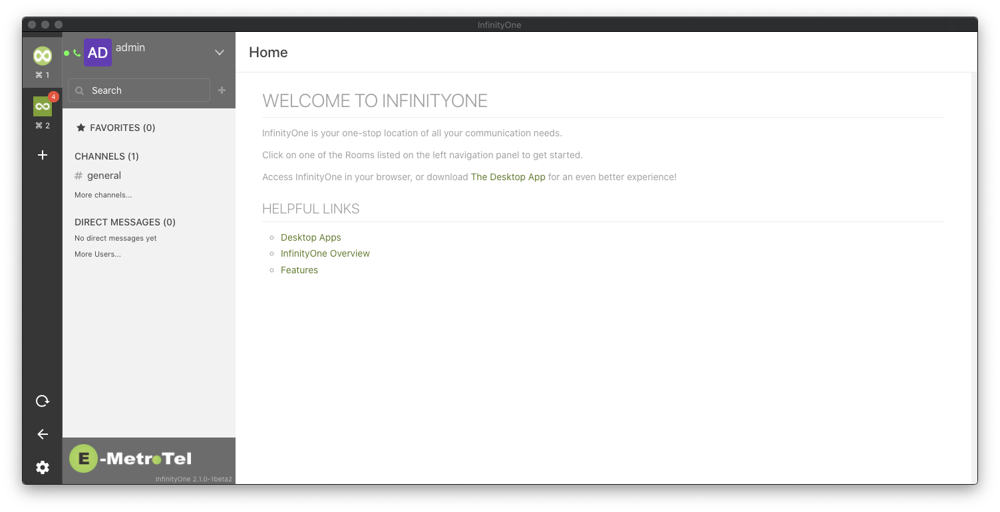

# Infinity One Desktop Client

Next Generation Desktop client for Infinity One. Available for Mac, Linux and Windows.

# Download
Please see [installation guide](https://chat.spallen.com/help/desktop-app-install-guide).

# Features
* Sign in to multiple servers
* Desktop Notifications with inline reply support
* Multi-language SpellChecker
* OSX/Win/Linux installers
* Automatic Updates (macOS/Windows/Linux)
* Keyboard shortcuts
* Video Conference support

# Development
Please see our [development guide](./development.md) to get started and run app locally.

# Contribute

If you want to contribute please make sure to read [our documentation about contributing](./CONTRIBUTING.md) first.

* [Issue Tracker](https://github.com/infinityoneframework/infinityone-electron-vue/issues)

# License
Released under the [MIT](./LICENSE) license.
